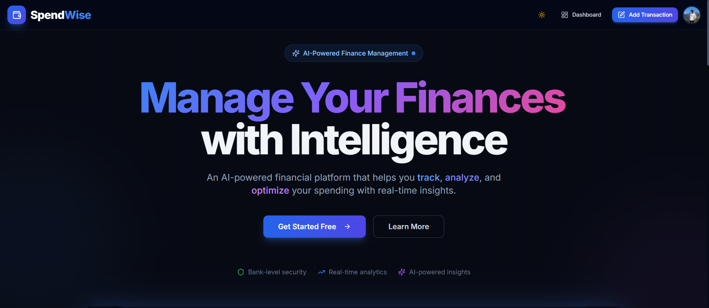
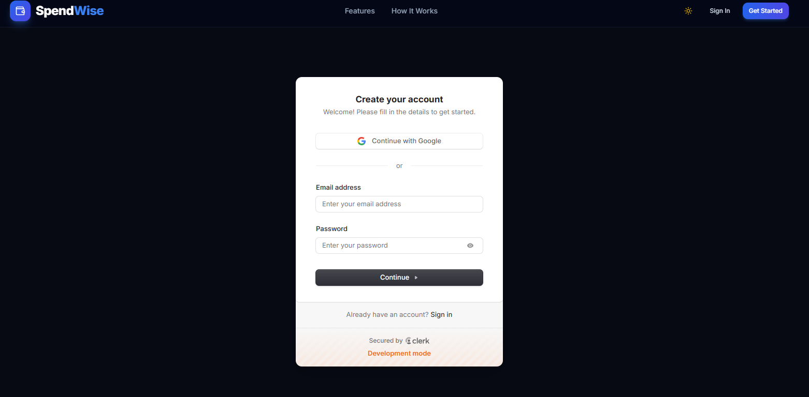
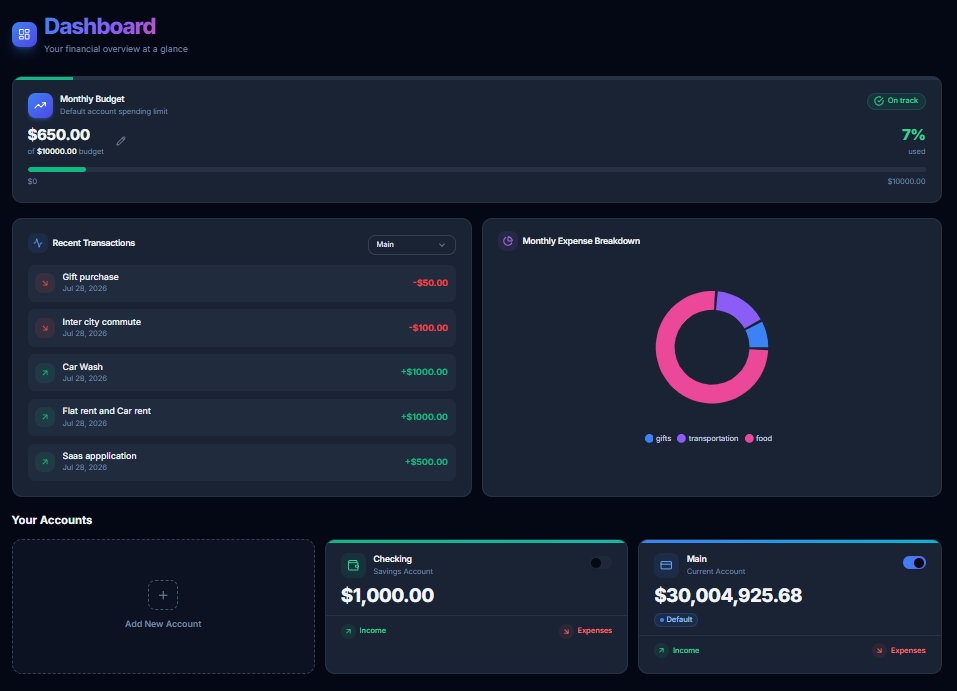
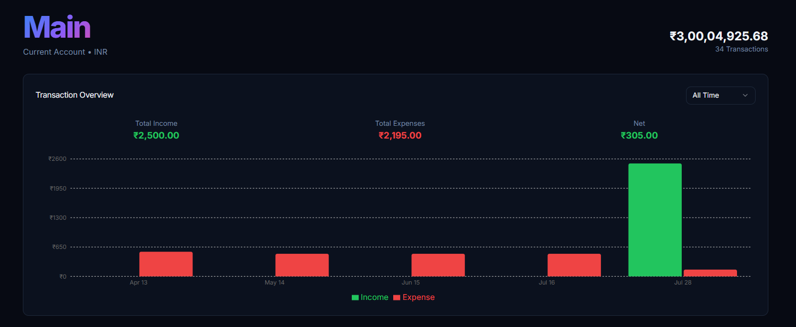
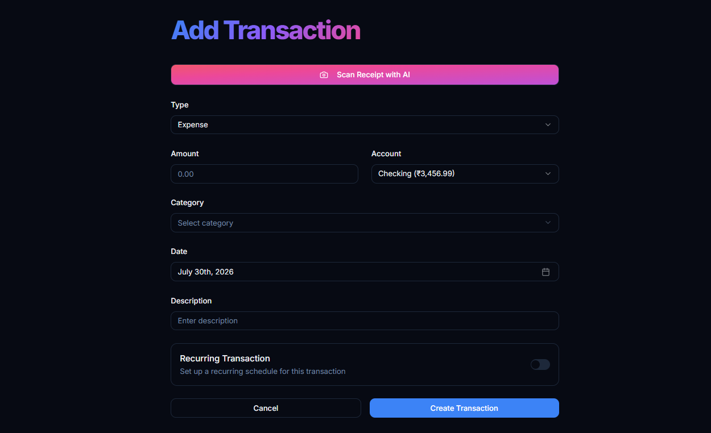
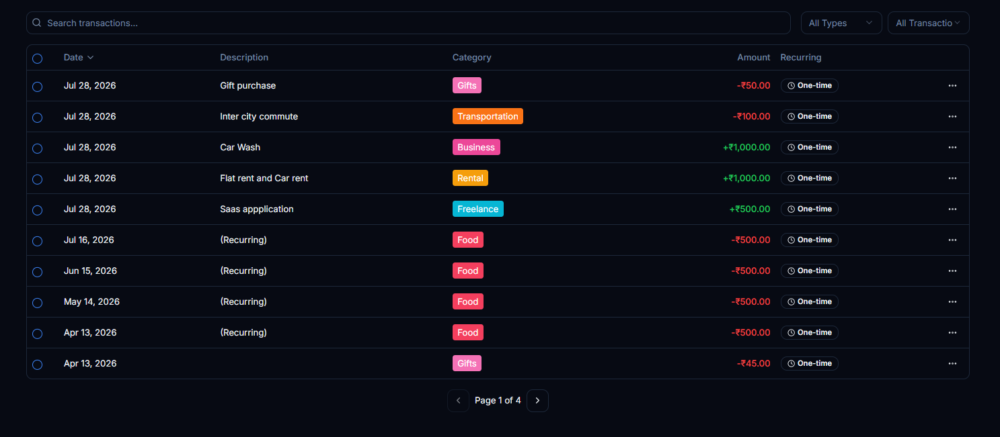
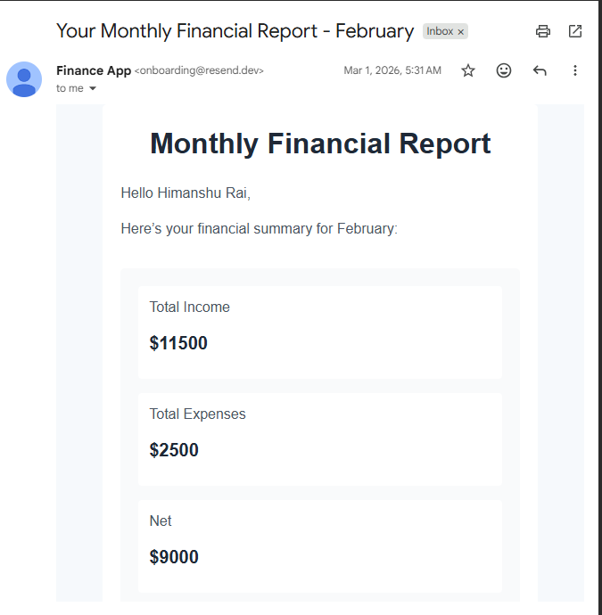
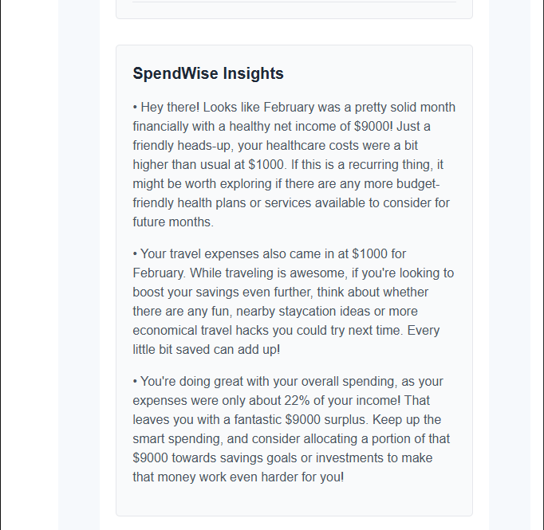

# SpendWise

A personal finance app I built to actually understand how server-first Next.js apps come together in production: accounts, transactions, budgets, recurring payments, and an AI layer on top. Not another CRUD-with-a-database tutorial project.

Most of the logic runs through Server Actions instead of a REST API. Prisma talks to Postgres. Inngest handles everything that has to happen without a user in the loop — recurring transactions, budget alerts, monthly reports. Gemini reads receipts and writes the monthly insight text.

**Stack:** Next.js 16 (App Router) · TypeScript · PostgreSQL + Prisma · Clerk · Inngest · Gemini · Arcjet · Resend


The copy here is at least honest about what the app does instead of reaching for marketing filler. "Get Started" drops straight into Clerk, no waitlist gate.

---

## What it does

- Multiple accounts per user (current/savings), each with its own balance and currency, one flagged default
- Transactions with categories, receipts, and soft deletes. Nothing is hard-deleted; `deletedAt` gates every query
- Recurring transactions (daily/weekly/monthly/yearly) that regenerate themselves through a scheduled job rather than a timer sitting in the browser
- One monthly budget per user, with email alerts once spend crosses 80%
- Receipt scanning: upload a photo, Gemini pulls out amount, date, merchant, and a suggested category, and pre-fills the transaction form
- Monthly financial reports — Gemini looks at the month's income/expense/category breakdown and writes three plain-language insights, emailed out on the 1st
- Idempotency keys on transaction creation so a retried form submission can't double-charge an account
- Audit log on every account/transaction/budget mutation

## Sign in



Auth is entirely delegated to Clerk. No hand-rolled password hashing, session logic, or "forgot password" flow. Google OAuth and email/password both run through the same hosted component. The "Development mode" banner is Clerk's own and goes away once production keys are set.

## Dashboard



The budget progress bar, recent transactions, and category breakdown all come from the same two server actions, `getCurrentBudget` and `getDashboardData`. There's no client-side fetch waterfall stitching the page together after the fact.



Per-account view with an income/expense chart on Recharts. The totals shown above the chart come from the same transaction rows the chart itself is built from, so there's one source of truth for both.

## Adding a transaction



"Scan Receipt with AI" is a real call to `scanReceipt()`, which sends the image to Gemini and comes back with amount, category, and description already filled in. The recurring toggle at the bottom is what actually feeds the Inngest scheduler — flip it on and the transaction shows up in the daily due-check.



Search, type/category filters, and pagination, backed by `getAccountWithTransactions`. Pagination happens with `skip`/`take` in the query itself instead of pulling everything and slicing it in the browser. Recurring entries are tagged so they're easy to spot in the list.

## Why it's built this way

**Server Actions instead of a REST layer.** Every mutation — `createTransaction`, `updateBudget`, `bulkDeleteTransactions`, and so on — lives in `actions/` and gets called directly from Server Components and forms. There's no parallel API surface to keep in sync with the frontend, and Zod validation runs in the same function that touches the database. The two real API routes that do exist are `/api/inngest`, because Inngest needs an HTTP endpoint to invoke functions, and `/api/seed`, a dev-only route for seeding demo data.

**Inngest instead of cron on a server.** Four functions cover everything that shouldn't block a request:

| Function | Trigger | Job |
|---|---|---|
| `triggerRecurringTransactions` | daily cron | Finds transactions due today, fans out one event per transaction |
| `processRecurringTransaction` | event, throttled 10/min per user | Creates the new transaction, updates the account balance, advances `nextRecurringDate` |
| `checkBudgetAlerts` | every 6 hours | Sums this month's expenses against the user's budget, emails a warning past 80%, gated by `lastAlertSent` so it doesn't spam |
| `generateMonthlyReports` | 1st of the month | Pulls last month's stats per user, asks Gemini for three insights, sends the report by email |

The recurring-transaction trigger and processor are split into two functions on purpose. If a spike in due transactions hit a single function looping over everything, one bad transaction could take the whole batch down with it. Splitting them means each transaction becomes its own throttled, independently retryable event instead.

**Two layers of Arcjet.** `proxy.ts` (Next 16's replacement for `middleware.ts`) runs Shield and bot detection on every request, ahead of Clerk's session check. Separately, `lib/arcjet.ts` applies a token-bucket rate limit — 10/hour, keyed on Clerk user ID — inside the account- and transaction-creation actions themselves. The edge layer catches obvious abuse early; the per-action limiter catches an authenticated user hammering one specific mutation.

**Soft deletes everywhere.** `withActive()` in `lib/db-utils.ts` wraps every read query with `deletedAt: null`. Deleting a transaction or account just stamps a timestamp. Balances get recalculated from the row that's still there, and the audit trail never has a gap in it.

## AI features

Two Gemini integrations doing two different things.



These three lines come from that month's actual income, expenses, and category totals fed into the prompt — they change every month because the underlying numbers do. If Gemini's response doesn't parse as JSON, `generateFinancialInsights` falls back to three generic-but-useful lines instead of letting the whole email job fail on a bad response.



Same pipeline, other end. `generateMonthlyReports` sends this through Resend on the 1st of the month, and the numbers in it match whatever the dashboard shows for that same period — same query, two different places it gets rendered.

## Architecture

```
Browser
  │
  ▼
proxy.ts  →  Arcjet Shield + bot detection  →  Clerk session check
  │
  ▼
Next.js App Router  (Server Components + Server Actions)
  │
  ├─→ actions/*.ts  →  Zod validation  →  Arcjet rate limit  →  Prisma  →  PostgreSQL
  │
  ├─→ scanReceipt()  →  Gemini (vision)  →  pre-fills transaction form
  │
  └─→ /api/inngest  →  4 background functions  →  PostgreSQL
                          │
                          ├─ recurring transaction engine
                          ├─ budget alert checker (Resend)
                          └─ monthly report generator  →  Gemini  →  Resend
```

## Data model

Five Prisma models: `User`, `Account`, `Transaction`, `Budget`, `AuditLog`.

There's no separate table for recurring transactions. A `Transaction` carries `isRecurring`, `recurringInterval`, `nextRecurringDate`, and `lastProcessed`, and the Inngest scheduler just reads those fields off the row. `Budget` is one per user (`userId` is `@unique`) and tracks `lastAlertSent` so the alert job knows whether it's already warned someone this month. `Transaction.idempotencyKey` is unique and optional; set it, and a duplicate submission returns the original record instead of creating a second one.

## Project structure

```
app/
├─ (auth)/                    sign-in, sign-up — Clerk
├─ (main)/
│  ├─ dashboard/              accounts overview, budget progress, spend chart
│  ├─ account/[id]/           per-account transaction table, pagination
│  └─ transaction/
│     ├─ create/               transaction form + receipt scanner
│     └─ [id]/                 edit
└─ api/
   ├─ inngest/                 Inngest function handler
   └─ seed/                    dev-only demo data seeding

actions/                      Server Actions — this is where the logic lives
├─ account.ts                 account queries, bulk delete, default-account switching
├─ transaction.ts             create/update/list transactions, receipt scanning
├─ dashboard.ts                account creation, dashboard data fetch
├─ budget.ts                  budget CRUD + current-month spend calculation
└─ seed.ts

lib/
├─ prisma.ts                  Prisma client singleton
├─ arcjet.ts                  token-bucket rate limiter for server actions
├─ db-utils.ts                withActive() — soft-delete query helper
├─ checkUser.ts               syncs a Clerk session to a User row on first login
└─ inngest/
   ├─ client.ts
   └─ function.ts             all 4 background jobs

prisma/
├─ schema.prisma
└─ migrations/

emails/                       React Email templates (budget alert, monthly report)
components/                   dashboard widgets, forms, shadcn/ui primitives
proxy.ts                      Arcjet + Clerk middleware (Next 16 naming)
```

## Running it locally

```bash
git clone https://github.com/Raih1107/SpendWise-AI-Finance.git
cd SpendWise-AI-Finance
npm install
npx prisma migrate dev
npm run dev
```

Background jobs won't fire without the Inngest dev server running alongside it:

```bash
npx inngest-cli@latest dev
```

### Environment variables

```env
DATABASE_URL=
DIRECT_URL=

NEXT_PUBLIC_CLERK_PUBLISHABLE_KEY=
CLERK_SECRET_KEY=

GEMINI_API_KEY=

ARCJET_KEY=

INNGEST_EVENT_KEY=
INNGEST_SIGNING_KEY=

RESEND_API_KEY=
```

`DIRECT_URL` is needed alongside `DATABASE_URL` if you're on Neon or Supabase's pooled connection — Prisma migrations need the direct, unpooled connection string.

## Deploying

Runs on Vercel.

1. Set every variable above in the project's environment settings
2. Point `DATABASE_URL` / `DIRECT_URL` at a pooled Postgres instance (Neon or Supabase both work)
3. Register the deployed `/api/inngest` URL with Inngest Cloud. Skip this and none of the four scheduled jobs run in production
4. Run `npx prisma migrate deploy` against the production database before the first deploy

```bash
vercel
```

## Known gaps / what I'd do next

- `eslint-config-next` is still pinned at 15.0.3 while the app runs Next 16 — needs bumping
- No test suite yet
- Multi-currency is stored (`Account.currency`) but never converted. A USD and INR account just show raw numbers side by side right now
- Bank account integration (Plaid/Setu) would remove manual entry entirely
- CSV/PDF export of transaction history

